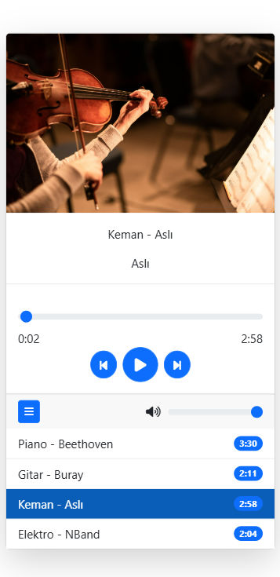

# 🎵 Music Player

Kullanıcıların müzik çalabileceği, duraklatabileceği ve çalma listesindeki şarkılar arasında geçiş yapabileceği basit bir müzik çalar uygulaması.

## Proje Konusu

Bu proje, kullanıcıların müzik dosyalarını oynatabileceği, duraklatabileceği ve çalma listesi yönetimi yapabileceği bir **Müzik Çalar Uygulamasıdır**. Kullanıcılar ses seviyesini ayarlayabilir, çalma listesindeki şarkılar arasında geçiş yapabilir ve oynatma durumunu kontrol edebilirler.

## Neden Geliştirildi, Motivasyon

Bu uygulamayı geliştirme motivasyonum: **JavaScript ve web geliştirme konusundaki becerilerimi ilerletmek, medya kontrollerini öğrenmek ve interaktif bir kullanıcı deneyimi oluşturmak** istedim.

## Ne Öğrendim?

Bu projeyi geliştirirken aşağıdaki konularda bilgi ve deneyim kazandım:

- **HTML, CSS, JavaScript** kullanarak etkileşimli bir müzik çalar geliştirme.
- **DOM manipülasyonu** ile şarkı listesi ve oynatma kontrollerini dinamik hale getirme.
- **Event Listener'lar** ile kullanıcı girişlerini yönetme.
- **Bootstrap** ile modern ve responsive bir arayüz oluşturma.

## Özellikler  

✅ Oynatma, duraklatma, sonraki ve önceki şarkıya geçme kontrolleri  
✅ Şarkı başlığı, sanatçı adı ve süresini görüntüleme  
✅ Ses seviyesi kontrolü ve sesi kapatma/açma özelliği  
✅ Etkileşimli ilerleme çubuğu  
✅ Çalma listesi desteği  

## Ekran Görüntüleri

